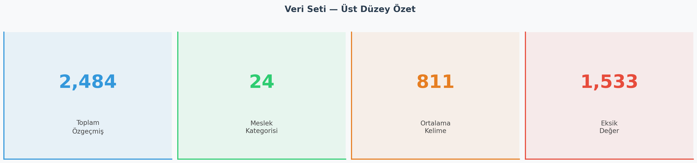
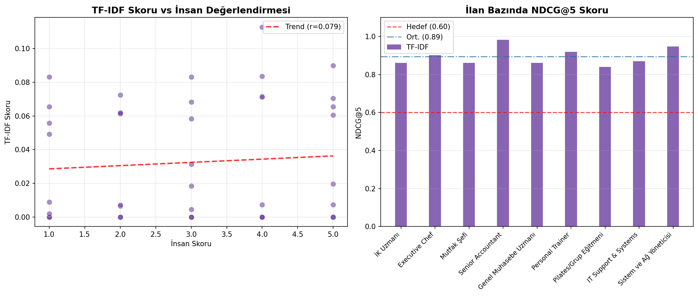
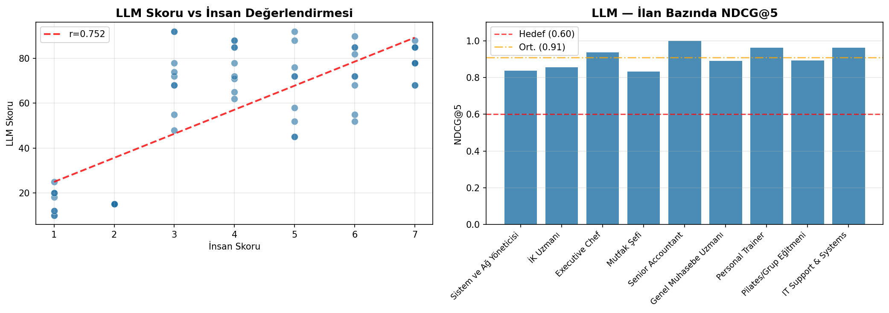
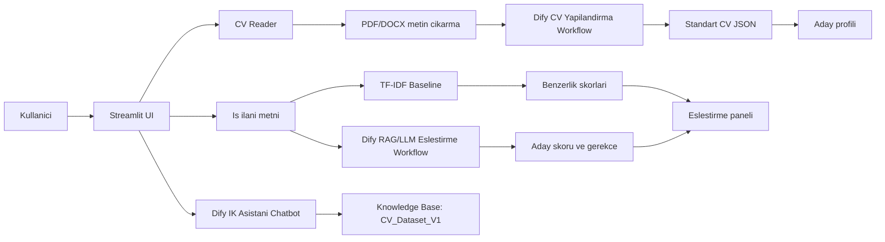

# Yapay Zeka Destekli CV Analiz Asistani

Kocaeli Universitesi Yazilim Muhendisligi bolumu icin hazirlanan bu proje, CV metinlerini yapilandiran, adaylari is ilanlariyla eslestiren ve IK ekiplerine aciklanabilir karar destek ciktisi sunan bir Streamlit uygulamasidir.

Sistem PDF/DOCX CV dosyalarindan metin cikarir, Dify uzerindeki Claude tabanli workflow ile CV'yi standart JSON semasina donusturur, is ilani metnine gore aday havuzunu hem TF-IDF baseline hem de LLM/RAG yaklasimi ile siralar. Ayrica Dify chatbot akisi uzerinden adaylar ve IK surecleri hakkinda soru-cevap yapilabilir.

## Ozellikler

- PDF ve DOCX CV yukleme
- CV metninden egitim, deneyim, teknik beceri ve toplam deneyim yili cikarma
- Dify workflow ile JSON tabanli CV yapilandirma
- Is ilani metnine gore TF-IDF ve LLM destekli aday eslestirme
- Dify knowledge base baglantili IK asistani sohbeti
- H1-H3 metrik raporlari ve gorsellestirmeleri
- Streamlit tabanli koyu temali IK paneli

## Ekran Goruntuleri

Asagidaki gorseller `visuals/` klasorunde uretilen analiz ve model raporlarindan orneklerdir.







## Mimari



## Teknoloji Yigini

| Katman | Teknoloji |
| --- | --- |
| Arayuz | Streamlit |
| Dil | Python 3.x |
| CV okuma | PyMuPDF, python-docx |
| Veri isleme | pandas |
| Baseline model | scikit-learn TF-IDF, Logistic Regression |
| LLM/RAG | Dify workflow, Claude Sonnet |
| Metrikler | JSON alan dogrulugu, Pearson korelasyonu, NDCG@5, F1-score |
| Gorsellestirme | matplotlib, seaborn |

## Klasor Yapisi

```text
cv-analiz-asistani/
├── data/
│   ├── raw/                 # Ham CV veri seti
│   └── processed/           # Temizlenmis CV metinleri ve ground truth JSON
├── docs/                    # Metrik sonuclari, RAG testleri, insan degerlendirmesi
├── notebooks/               # EDA ve deney notebook'lari
├── reports/                 # Akademik rapor ciktilari
├── src/                     # Uygulama, API, metrik ve model kodlari
├── visuals/                 # Analiz ve model gorselleri
├── .env.example             # Gerekli ortam degiskenleri sablonu
├── requirements.txt
└── README.md
```

## Kurulum

1. Repoyu klonlayin:

```bash
git clone https://github.com/bsenurbas/cv-analiz-asistani.git
cd cv-analiz-asistani
```

2. Sanal ortam olusturun ve aktif edin:

```bash
python -m venv .venv
.venv\Scripts\activate
```

3. Bagimliliklari yukleyin:

```bash
pip install -r requirements.txt
```

4. Ortam degiskenlerini hazirlayin:

```bash
copy .env.example .env
```

`.env` dosyasina Dify workflow/chatbot API anahtarlarini ekleyin. Gercek anahtarlar repoya yuklenmemelidir.

## Ortam Degiskenleri

| Degisken | Kullanim yeri | Aciklama |
| --- | --- | --- |
| `DIFY_API_KEY` | `src/dify_api.py`, `src/metrics.py` | CV yapilandirma workflow anahtari |
| `ESLESTIRME_API_KEY` | `src/app.py`, `src/llm_metrik.py` | Is ilani-CV eslestirme workflow anahtari |
| `IK_ASISTAN_API_KEY` | `src/app.py` | IK asistani chatbot anahtari |
| `SKORLAMA_API_KEY` | `src/llm_metrik.py` | LLM skorlama/metrik workflow anahtari |

## Calistirma

Streamlit uygulamasini baslatmak icin:

```bash
streamlit run src/app.py
```

Metrik scriptleri:

```bash
python src/metrics.py
python src/model_karsilastirma.py
python src/llm_metrik.py
```

## Metrik Ozeti

Mevcut sonuclar `docs/metrik_sonuclari.txt` dosyasindan alinmistir.

| Hipotez | Metrik | Model/Akis | Hedef | Sonuc | Durum |
| --- | --- | --- | --- | --- | --- |
| H1 | JSON alan dogrulugu | Dify CV yapilandirma | >= %85 | %86.7 | Basarili |
| H2 | Pearson korelasyonu | TF-IDF vs insan skoru | >= 0.70 | 0.079 | Hedefin altinda |
| H2 | Pearson korelasyonu | LLM vs insan skoru | >= 0.70 | 0.752 | Basarili |
| H3 | NDCG@5 | TF-IDF | >= 0.60 | 0.894 | Basarili |
| H3 | NDCG@5 | LLM | >= 0.60 | 0.908 | Basarili |
| H4 | Aciklanabilir eslestirme kalitesi | RAG/LLM aday gerekceleri | Tanimlanacak | RAG test raporu mevcut | Olcum bekliyor |
| H5 | Kullanici deneyimi / IK asistani yararliligi | Streamlit + chatbot | Tanimlanacak | Uygulama akisi mevcut | Olcum bekliyor |

## Dify Workflow Notlari

`docs/workflow_notlari.txt` dosyasina gore kurulu akislar:

- CV Yapilandirma workflow: input `cv_metni`, output `cv_json`
- CV Eslestirme workflow: input `ilan_metni`, output `eslesme_sonucu`
- IK Asistani chatbot: knowledge base destekli sohbet akisi

## Guvenlik Notlari

- `.env` dosyasi `.gitignore` icinde yer alir ve repoya yuklenmemelidir.
- Gercek API anahtarlari yalnizca lokal `.env` dosyasinda tutulmalidir.
- Paylasilacak ornek konfigurasyon icin `.env.example` kullanilmalidir.

## Ekip

| Isim | Rol | Odak |
| --- | --- | --- |
| Buse Nur Bas | Backend & AI Ops | Dify/LLM entegrasyonu, API gelistirme |
| Sude Cokyasar | Data & Frontend | Veri isleme, RAG mimarisi, UI tasarimi |
